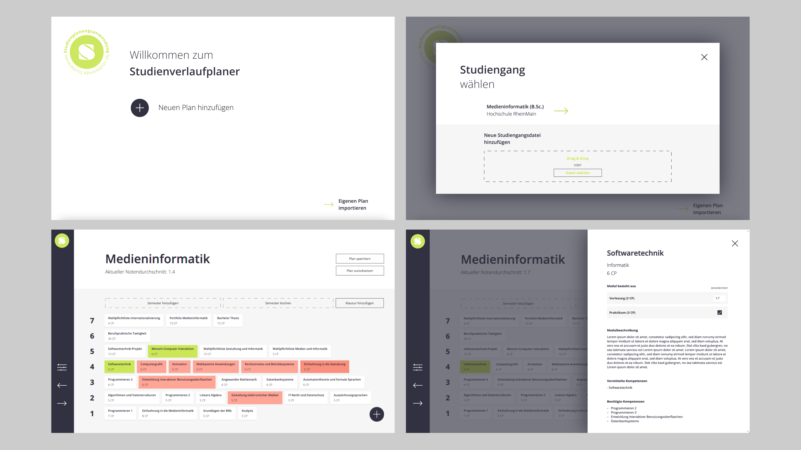

# Study planner

Application to plan the course of your studies

*student project in semester 4, group work* 

**Features:**
- Drag and drop courses and exams into semesters
- Get info about courses and enter grades 
- Undo/Redo actions
- Save plan and import plans

## Main Technologies
- Java
- JavaFX

## How to run
```bash
./gradlew run
```

## Impressions

